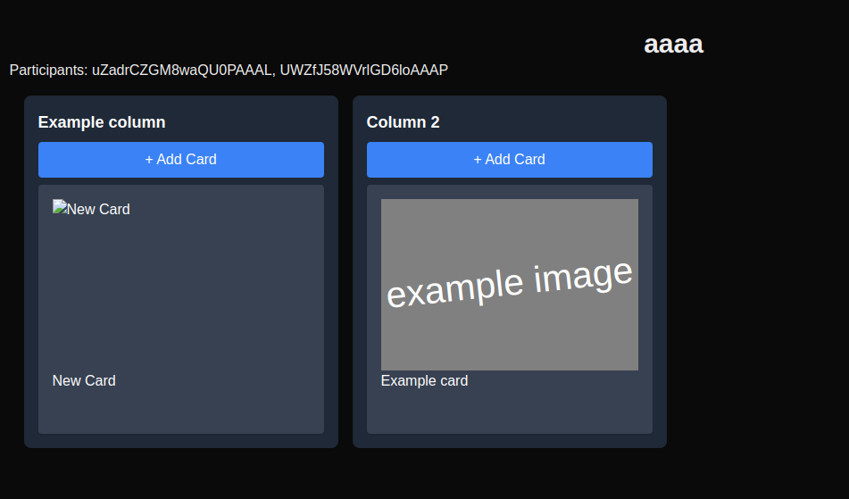

= Retro-board ideation starter

IMPORTANT: This is a WIP project to get familiar with some technologies. +
Do not attempt to use this project as any kind of reference. +
It is written badly.

== Business need

Have some columns with cards that you can move around.

Changes are broadcast to all connected clients via WebSockets.

Supported User Actions:

- [x] creation of a board with username
- [x] adding new cards
- [x] moving cards between columns (drop card on "New card" button)
- [x] changing contents of a card to be broadcast to other users immediately
- [x] image support in cards, especially for memes and gifs

== Deployment

Project is configured to be deployed on Render.com automatically after each push.

* FE: https://retro-board-ui.onrender.com - the main app connected to BE
* BE: https://retro-board-backend-ldaq.onrender.com - nothing to see here, just WebSocket server

== Roadmap

NOTE: Some features may or may not be added based on my leniency.

- [ ] disconnecting users from boards, it's clunky at best
- [ ] cards with "submit" button to broadcast changes, now it's immediate and can be annoying/causes problems
- [ ] deleting cards
- [ ] ownership of boards, with additional features for owners
- [ ] ownership of cards, to not be able to modify other's cards
- [ ] add minimal amount of tests
- [ ] customizing columns in boards
- [ ] persisting data of boards in a database instead of memory
- [ ] better architecture of FE and BE
- [ ] proper styling

== Technology stack

- TypeScript
- Backend: NestJS
- Frontend: React + NextJS
- WebSockets (websocket.io)

== Development

link:https://devenv.sh[Use devenv.sh] and do not bother with setting up your environment.

[shell,terminal]
----
$ devenv up
----

Backend with WebSocket server will be running on port 8080 and frontend on port 3000. Visit link:https://localhost:3000[localhost:3000] to see the frontend.

=== Development Shell

You can access development shell to run commands like `npm run lint` or `npm run test`.

[shell,terminal]
----
$ devenv shell
----

=== Tests

Nothing here yet.