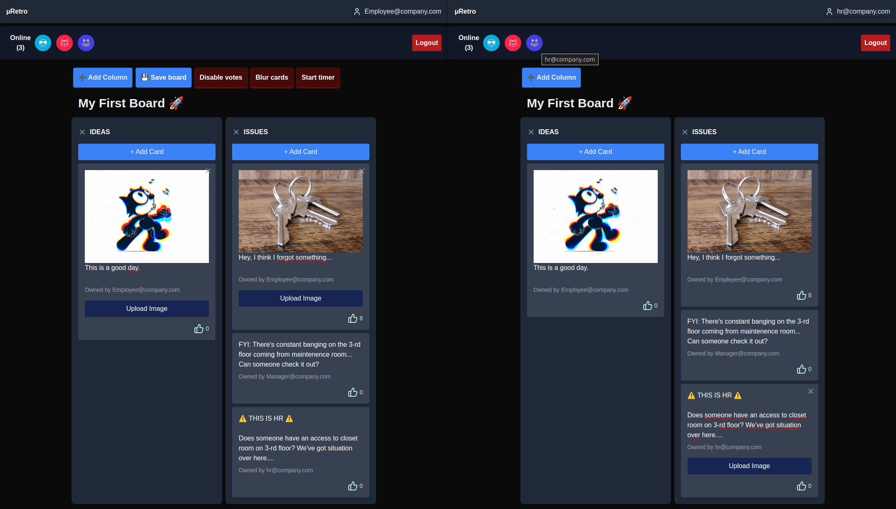

= μRetro - Retro-board for teams in TypeScript

IMPORTANT: This is a WIP project to get familiar with some technologies. +
Do not attempt to use this project as any kind of reference. +
It is written badly and has multiple architecture flaws.

== Business need

Have some columns with cards that you can move around on kanban-like board for multiple users.

Changes are broadcast to all connected clients via WebSockets.

Supported User Actions:

- [x] creation of a board with username
- [x] adding new cards
- [x] deleting cards that belong to the user
- [x] moving cards between columns
- [x] changing contents of a card to be broadcast to other users immediately
- [x] image support in cards, especially for memes and gifs
- [x] votes on cards
- [x] blur/de-blur cards for owners
- [x] ownership of cards, to not be able to modify other's cards
- [x] customizing columns in boards, i.e. add, delete, change name of column
- [x] ownership of boards, with additional features for owners
- [x] disconnecting users from boards
- [x] ability to save data of a board to a file

== Deployment

Project is configured to be deployed on Render.com automatically after each push.

NOTE: Loading those can take up to 50 seconds, as Render.com puts instances on hold when they're not used in free tier.

* FE: https://retro-board-ui.onrender.com - the main app connected to BE
* BE: https://retro-board-backend-ldaq.onrender.com - nothing to see here, just WebSocket server

IMPORTANT: Do not use those instances as real boards for your teams. Data is not persisted and can be lost at any time.

== Roadmap

NOTE: Some features may or may not be added based on my leniency.

- [ ] persisting data of boards in a database instead of memory (or in local storage)
- [ ] better architecture of FE and BE
- [ ] server-based timer - synchronized across all clients
- [ ] proper styling with mobile-first approach

== Technology stack

- Language: link:https://www.typescriptlang.org/[TypeScript]
- Backend: link:https://nestjs.com/[NestJS]
- Frontend: link:https://react.dev/[React] + link:https://nextjs.org/[Next.js]
- WebSockets (link:https://socket.io/[socket.io])

== Development

link:https://devenv.sh[Use devenv.sh] and do not bother with setting up your environment.

[shell,terminal]
----
$ devenv up
----

Backend with WebSocket server will be running on port 8080 and frontend on port 3000.

Visit link:https://localhost:3000[localhost:3000] to see the frontend.

=== Development Shell

You can access development shell to run commands like `npm run lint` or `npm run test`.

[shell,terminal]
----
$ devenv shell
----

=== Tests

Nothing here yet.

IMPORTANT: Never write code without tests for your domain logic. You're asking for trouble.

.Developer's Journey
[%collapsible]
====
One night I got struck by terrible insomnia and decided to write a simple app to get familiar with WebSockets. +

In my whole life, I've never written a single line of code that uses WebSockets, but I've architected a few systems that use them. Crazy, right? +

I've decided to use TypeScript for both frontend and backend, as I've been using it for a while now and I like it. +

This work assured me that WebSockets are not that hard to use, but they pose a lot of challenges when it comes to handling multiple clients and payloads. +

Proposed architecture is greatly flawed, as we're sending board updates as a whole payload, instead of sending only the changes. I'd do it differently if I had put more thought into it. +

I've also skipped writing tests, as I wanted to focus on the main functionality. This was a mistake, as I've spent a lot of time debugging and fixing issues that could be caught by tests, both on BE and FE. +

State management in React is not my strong suit, I should've used `useContext` or `useReducer` instead of `useState` for sharing state between components. I'll explore this in the future. +

I've skipped persistence layer implementation, as I wanted to focus on the main functionality. I'll probably use MongoDB for this, as it's easy to use and I'm familiar with it. +

I also did not spend much time on styling, as I wanted to focus on the main functionality. Application is unusable on mobile devices. CSS always was my weak point, but I'll try to improve it in the future. +

Both FE and BE architecture are not well-thought-out, as I've been adding features on the go. Currently, the code is a mess and it's hard to maintain. +

I'll probably rewrite this project from scratch, with better architecture and more tests in the future. +

It was a fun project to work on, I've learned a lot of things that I should've done differently. +

This experience will help me in the future to write better code and think more about the architecture of the systems using WS as primary source of truth.+

NOTE: To self: do not write code when you're sleep-deprived. It's a bad idea.

Another project on the shelf. EOT
====
